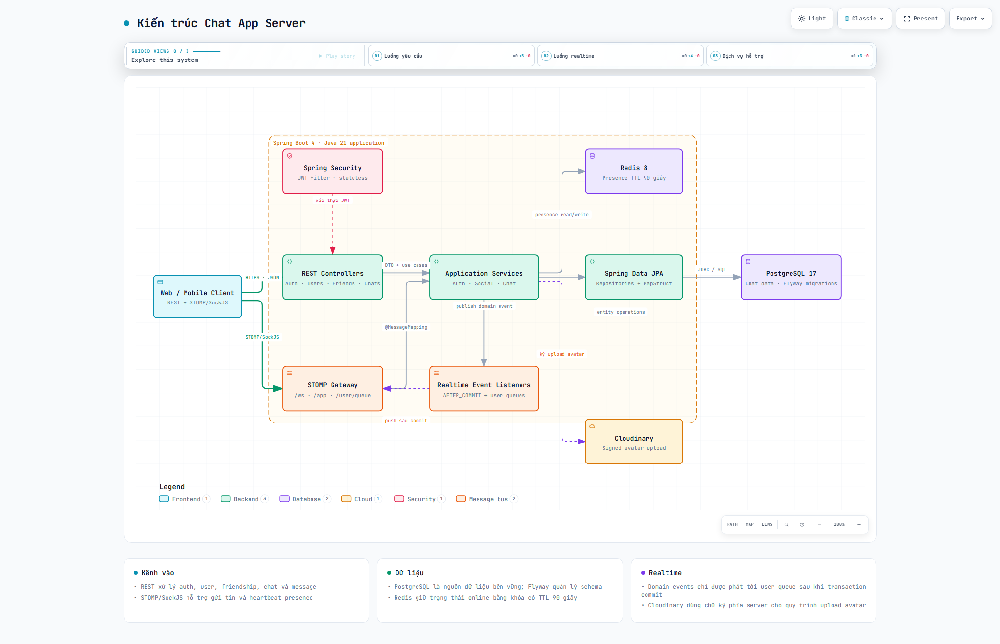
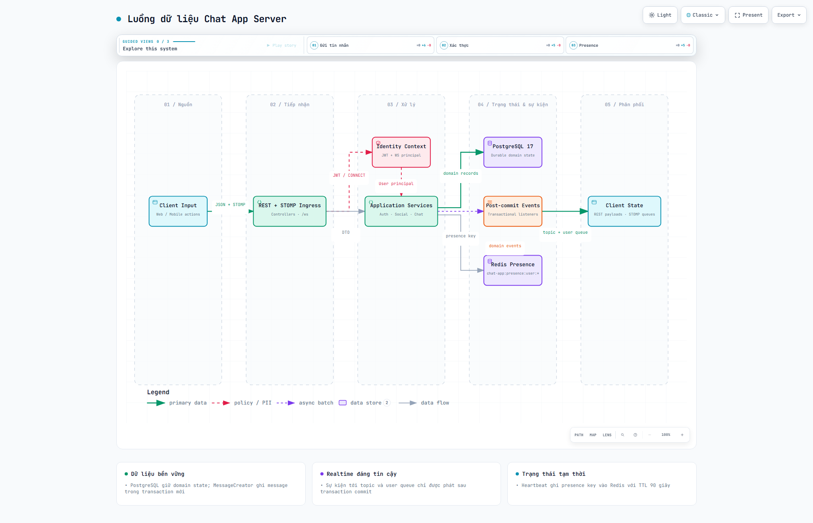
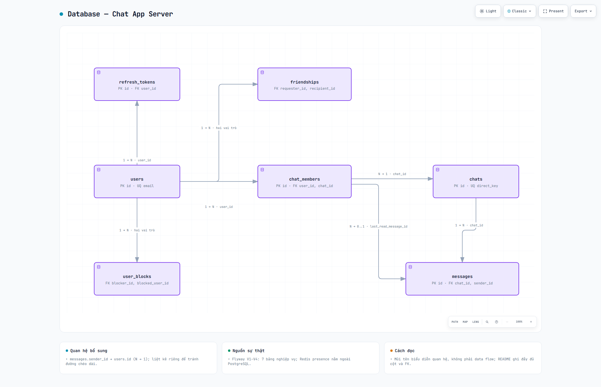
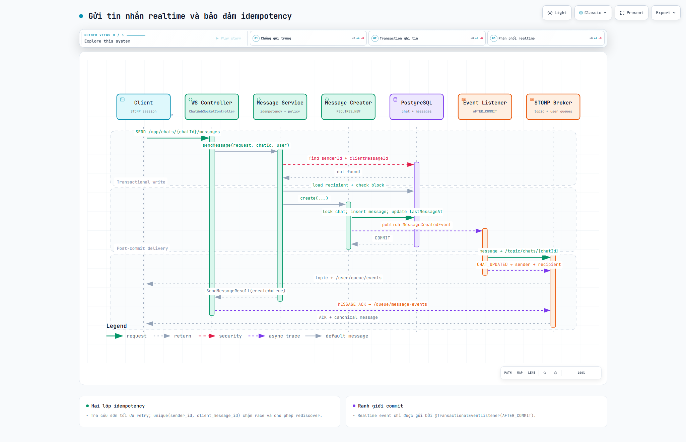
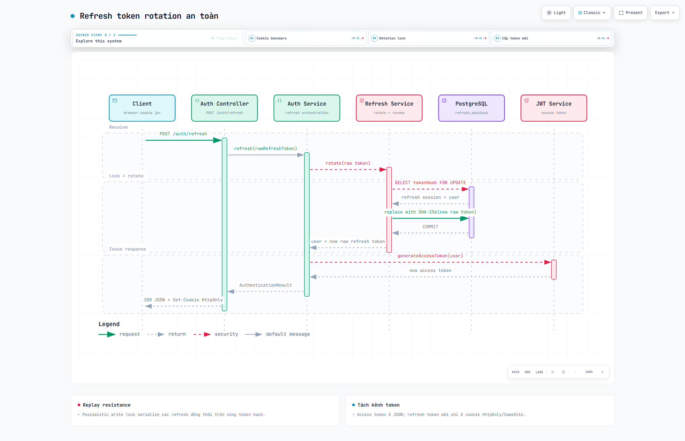
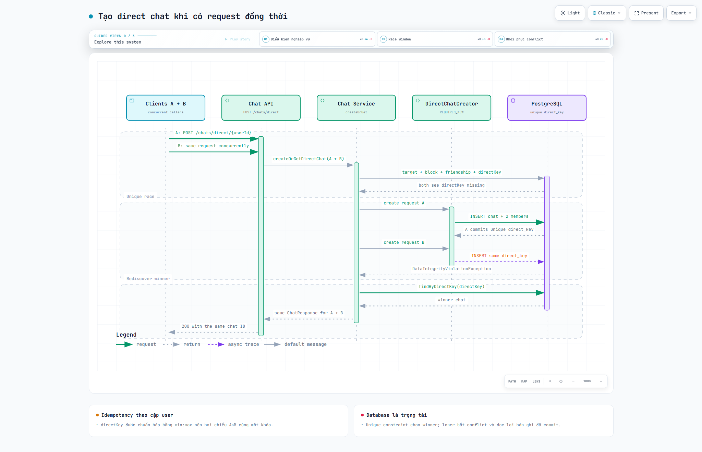

# Chat App Server

Backend chat realtime dùng Java 21, Spring Boot, PostgreSQL và Redis.

## Cài đặt

Yêu cầu: Docker và Docker Compose. Chạy các lệnh trong thư mục `chat-app-server`.

### 1. Cấu hình môi trường

Tạo file `.env`, thay các giá trị `your_*` bằng cấu hình của bạn:

```dotenv
POSTGRES_DB=chat_app
POSTGRES_USER=chat_app
POSTGRES_PASSWORD=your_database_password
POSTGRES_JDBC_URL=jdbc:postgresql://localhost:5432/chat_app
REDIS_HOST=localhost
REDIS_PORT=6379
REDIS_PASSWORD=your_redis_password
JWT_SECRET=your_base64_secret
CLOUDINARY_CLOUD_NAME=your_cloud_name
CLOUDINARY_API_KEY=your_api_key
CLOUDINARY_API_SECRET=your_api_secret
```

`JWT_SECRET` là Base64 của khóa ngẫu nhiên ít nhất 32 byte. Tạo bằng PowerShell:

```powershell
$jwtBytes = New-Object byte[] 32
$jwtRandom = [System.Security.Cryptography.RandomNumberGenerator]::Create()
$jwtRandom.GetBytes($jwtBytes)
$jwtRandom.Dispose()
[Convert]::ToBase64String($jwtBytes)
```

Không commit file `.env`.

### 2. Khởi chạy

```sh
docker compose up -d --build
```

Backend: `http://localhost:8080`. Database được tạo tự động bằng Flyway.

Xem log và dừng ứng dụng:

```sh
docker compose logs -f app
docker compose down
```

### Chạy backend ngoài Docker (tùy chọn)

Cài JDK 21, dùng `.env` ở trên và khởi động PostgreSQL/Redis:

```sh
docker compose up -d db redis
```

Windows:

```powershell
.\mvnw.cmd spring-boot:run "-Dspring-boot.run.profiles=dev"
```

Linux/macOS:

```sh
./mvnw spring-boot:run -Dspring-boot.run.profiles=dev
```

## Sơ đồ kiến trúc

### Tổng quan hệ thống



### Luồng dữ liệu



### Database



### Gửi tin nhắn realtime



### Refresh token rotation



### Tạo direct chat đồng thời


